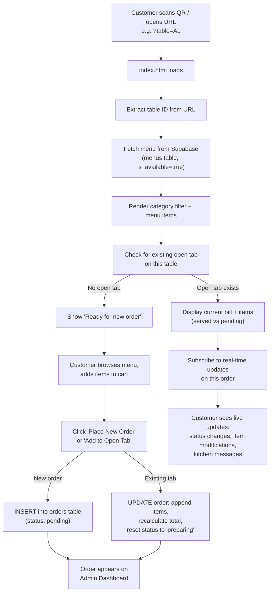
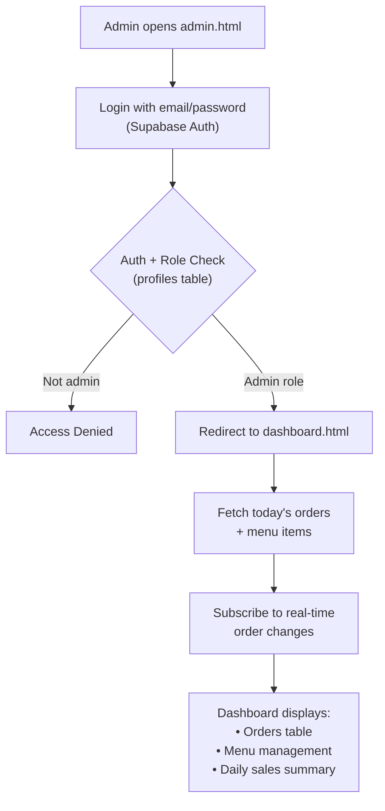
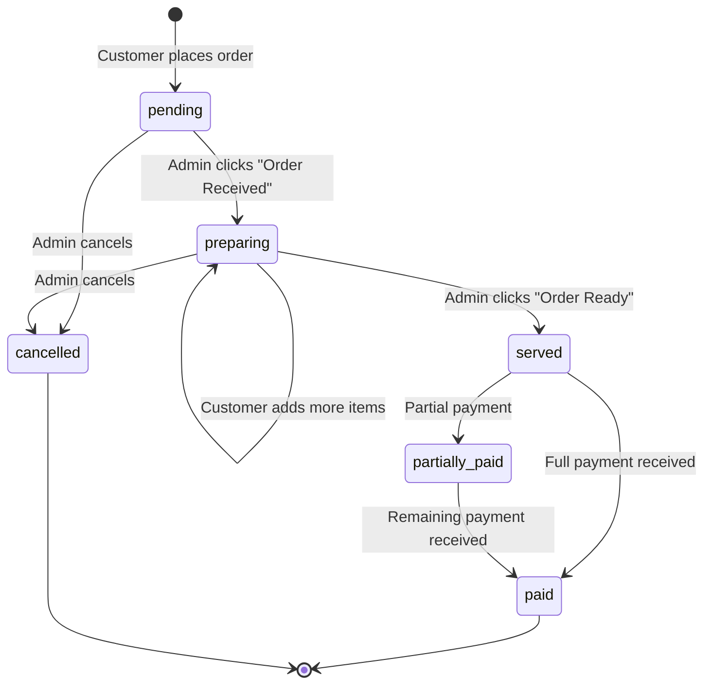
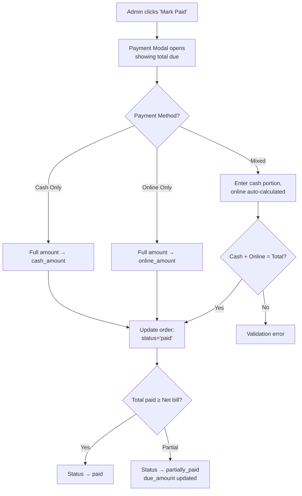

# Chakra Project — "The Classy" Restaurant POS System

## Overview

This is a **restaurant Point-of-Sale (POS) and online ordering system** called **"The Classy"**. It is a frontend-only web application (no server-side code) that connects directly to **Supabase** (a hosted PostgreSQL + real-time backend). The system has two sides: a **customer-facing menu** and an **admin dashboard**.

> [!TIP]
> The production frontend is deployed at `https://the-classy.pages.dev/` (Cloudflare Pages).

---

## Project File Structure

| File | Role |
|---|---|
| [index.html](file:///e:/project/Chakra/index.html) | Customer-facing menu & ordering page |
| [menu (1).js](file:///e:/project/Chakra/menu%20(1).js) | All customer-side logic (menu fetch, cart, order submission) |
| [index-style.css](file:///e:/project/Chakra/index-style.css) | Styles for the customer menu page |
| [admin.html](file:///e:/project/Chakra/admin.html) | Admin login page |
| [dashboard.html](file:///e:/project/Chakra/dashboard.html) | Admin dashboard (orders + menu management) |
| [admin (1).js](file:///e:/project/Chakra/admin%20(1).js) | All admin-side logic (auth, orders, payments, menu CRUD) |
| [styles.css](file:///e:/project/Chakra/styles.css) | Styles for the admin dashboard |
| [table_selector.html](file:///e:/project/Chakra/table_selector.html) | Manual table selection page for admin-initiated orders |

---

## Technology Stack

- **Frontend**: Vanilla HTML + JavaScript
- **Styling**: TailwindCSS (CDN) for menu page, vanilla CSS for dashboard
- **Backend**: [Supabase](https://supabase.com/) (PostgreSQL + Realtime subscriptions + Auth)
- **Deployment**: Cloudflare Pages (`the-classy.pages.dev`)

---

## Complete Application Workflow

### 1. Customer Flow (Menu → Order → Real-time Updates)

**Key Details:**
- The URL parameter `?table=A1` identifies which table the customer is at
- Prices are internally converted to **Paise (integer)** to avoid floating-point errors, then converted back to Rupees for display/storage
- When adding items to an existing tab, the order status resets to `preparing` to alert the kitchen
- Customers can **acknowledge admin messages** (e.g., "item removed due to unavailability")

---

### 2. Admin Flow (Login → Dashboard → Order & Menu Management)

---

### 3. Order Lifecycle (Status State Machine)

**Admin Actions per Status:**

| Order Status | Available Actions |
|---|---|
| **Pending** | "Order Received" → preparing, "Modify Items / Cancel" |
| **Preparing** | "Order Ready" → served, "Modify Items / Cancel" |
| **Served** | "Mark Paid" (payment modal), "Reduce Items" |
| **Partially Paid** | "Finalize Payment", "Reduce Items" |
| **Paid / Cancelled** | No actions (terminal states) |

---

### 4. Payment Flow

---

### 5. Menu Management (CRUD)

From the dashboard, admins can:
- **Add** new menu items (name, category, price, availability, "special" flag)
- **Edit** existing items via modal (update name, category, price, availability, special)
- **Delete** items permanently
- Categories are stored lowercase in the DB and displayed in Title Case

---

### 6. Manual Order Entry (Table Selector)

[table_selector.html](file:///e:/project/Chakra/table_selector.html) provides a grid of preset table buttons (A1–A4, B1–B6, C1–C4, D1–D6) plus a flexible text input for custom table IDs (e.g., "E1", "Counter", "Takeout"). Clicking a table opens the customer menu URL for that table, letting the admin place orders on behalf of walk-in customers.

---

### 7. Real-time Features

| Feature | Mechanism |
|---|---|
| Admin sees new orders instantly | Supabase Realtime channel on `orders` table (INSERT/UPDATE/DELETE) |
| Customer sees status changes | Supabase Realtime subscription filtered to their order ID |
| Browser notifications | `Notification` API — fires on new orders and item additions |
| Kitchen messages to customer | `customer_message` field on order — customer can acknowledge and dismiss |

---

### 8. Data Export

The admin can **export orders to CSV** with columns: ID, Table Number, Date, Time, Status, Net Total, Discount, Cash Paid, Online Paid, Due Amount, Items List, Admin Message — plus a **daily sales summary** appended at the bottom.

---

## Supabase Database Schema (Inferred)

### `orders` table
| Column | Type | Purpose |
|---|---|---|
| `id` | UUID | Primary key |
| `table_number` | text | Alphanumeric table ID (e.g., "A1") |
| `order_items` | JSONB | Array of `{item, qty, price, item_id}` |
| `total_amount` | numeric | Bill total in Rupees |
| `due_amount` | numeric | Remaining unpaid amount |
| `cash_amount` | numeric | Cash received |
| `online_amount` | numeric | Online/card received |
| `discount_amount` | numeric | Discount applied |
| `status` | text | pending / preparing / served / partially_paid / paid / cancelled |
| `served_item_count` | integer | How many items from the array have been served |
| `customer_message` | text | Admin-to-customer notification message |
| `created_at` | timestamp | Order creation time |
| `updated_at` | timestamp | Last modification time |

### `menus` table
| Column | Type | Purpose |
|---|---|---|
| `id` | UUID | Primary key |
| `item_name` | text | Menu item name (unique) |
| `category` | text | Category (stored lowercase) |
| `price` | numeric | Price in Rupees |
| `is_available` | boolean | Whether item shows on customer menu |
| `is_special` | boolean | "Today's Special" flag |

### `profiles` table
| Column | Type | Purpose |
|---|---|---|
| `id` | UUID | References Supabase auth user |
| `role` | text | User role (e.g., "admin") |
